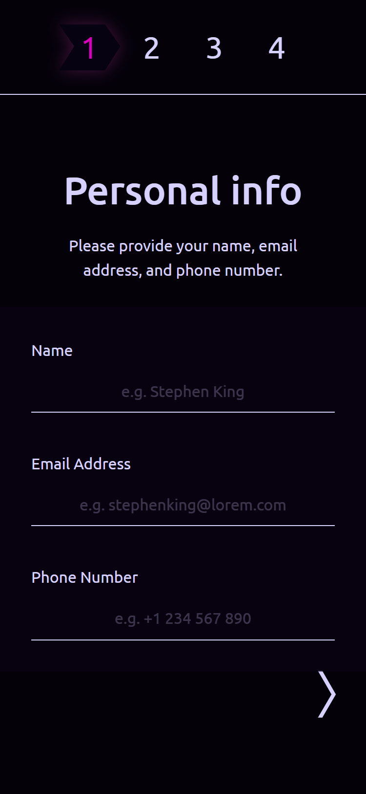
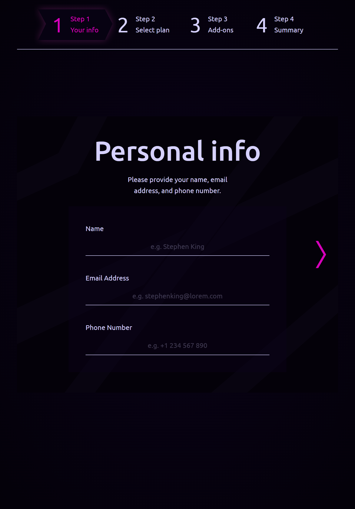
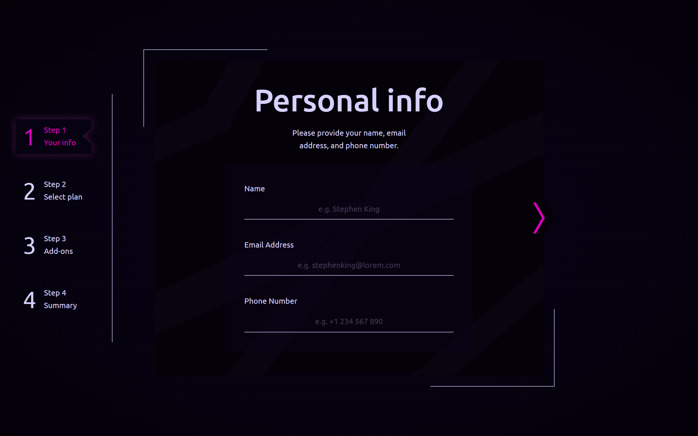

# Frontend Mentor - Multi-step form solution

This is a solution to the [Multi-step form challenge on Frontend Mentor](https://www.frontendmentor.io/challenges/multistep-form-YVAnSdqQBJ). Frontend Mentor challenges help you improve your coding skills by building realistic projects. 

## Table of contents

- [Overview](#overview)
  - [The challenge](#the-challenge)
  - [Screenshot](#screenshot)
  - [Links](#links)
- [My process](#my-process)
  - [Designed using](#designed-using)
  - [Built with](#built-with)
  - [Development notes](#development-notes)
    - [Design](#design)
    - [SPA vs routing](#spa-vs-routing)
    - [Form handling with Felte](#form-handling-with-felte)
    - [Active states and animations](#active-states-and-animations)
  - [Continued development](#continued-development)
  - [Useful resources](#useful-resources)
- [Author](#author)

## Overview

### The challenge

Users should be able to:

- Complete each step of the sequence
- Go back to a previous step to update their selections
- See a summary of their selections on the final step and confirm their order
- View the optimal layout for the interface depending on their device's screen size
- See hover and focus states for all interactive elements on the page
- Receive form validation messages if:
  - A field has been missed
  - The email address is not formatted correctly
  - A step is submitted, but no selection has been made - I deviated from this point slightly and provided the default options which will be applied if no selection has been made.

### Screenshot

### Links

- Solution URL: [Add solution URL here](https://your-solution-url.com)
- Live Site URL: [Add live site URL here](https://your-live-site-url.com)

## My process

### Designed using

- [Realtime Colors](https://www.realtimecolors.com/) - site for testing color schemes
- [Figma](https://www.figma.com/) - online design tool

### Built with

- Semantic HTML5 markup
- CSS custom properties
- Flexbox
- CSS Grid
- Mobile-first workflow
- Typescript
- [SvelteKit](https://kit.svelte.dev/) - fullstack JS framework
- [Felte](https://felte.dev/) -  form library for Svelte, Solid and React

### Development notes

#### Design

I found the original design somewhat lacking in color and decided to give it a more vibrant color scheme. I also made some small adjustments like changing the next/back buttons and a new Success message. However, the main structure of the document remains the same, as I don’t see a way to improve it.

#### SPA vs routing

While this project could be done as a single page application, I decided to use SvelteKit routing instead. This significantly increased its level of complexity so I am not sure if it was a good idea. On the other hand, I learned a lot about more advanced routing options like goto() which allows to open URLs programmatically and functions to trigger certain actions before and after navigating.
The side-effect of implementing every step as a route is some boilerplate such as imports and functions for submitting the forms. I did not manage to make them reusable. If you have suggestions how to reduce repetition in my code, please share them in the comments.

#### Form handling with Felte

To manage form handling, I used Felte library. The drawback of sticking to less popular frameworks is that the choice of supporting libraries is relatively narrow, and the information about them leaves a lot to be desired. However, Felte covers all the functions I needed and provides detailed documentation, so eventually I figured out how to use it.

The design required to trigger form validation and submission upon navigating to a new page. Implementing this was by far the hardest part of the project. Fortunately, Svelte stores made state management not an issue.

#### Active states and animations

While most active elements on the pages have simple hover/focus states such as color change and glow, the design called for a sliding pointer to indicate the currently open page. I was hoping to use built-in Svelte animations but did not find anything that would suit my needs and implemented the animation from scratch.

***

### Continued development

This project highlighted many aspects of SvelteKit and TypeScript I am yet to learn. However, it was a lot of work. I even feel a little burned out. Because of that, I am going to take a break from Frontend Mentor challenges and focus on other things such as web design.

### Useful resources

- [Dribbble](https://dribbble.com/) - a site for sharing your design works and a great source of inspiration.

## Author

-   Frontend Mentor - [@twDevNoob](https://www.frontendmentor.io/profile/twDevNoob)